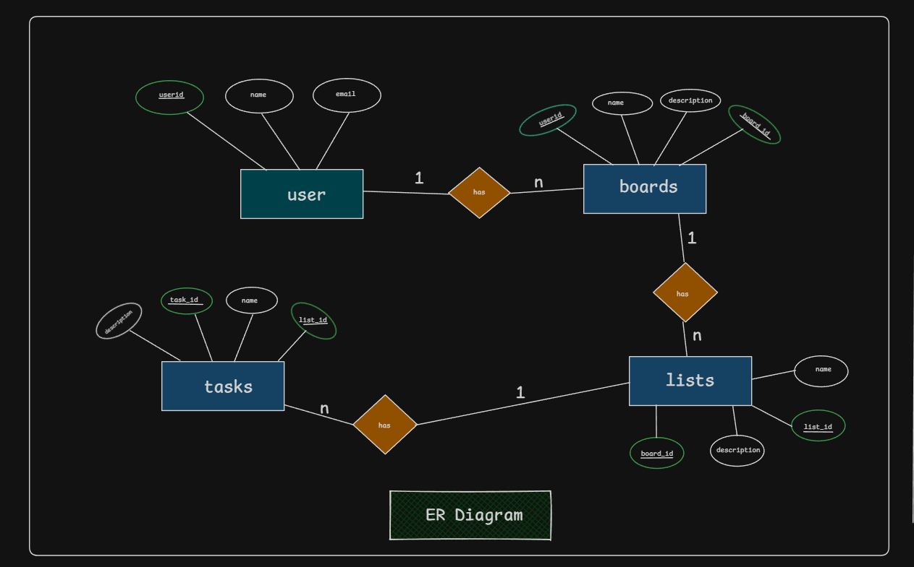
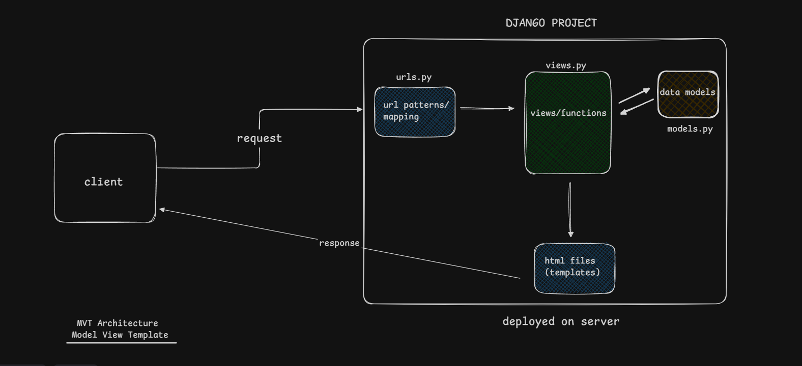

# Tasklet

Tasklet is a project and task management backend built with **Python, Django, and Django REST Framework (DRF)**.

The application provides a RESTful backend for managing boards, lists, and tasks, with JWT-based authentication and authorization.

## Tech Stack

- Python
- Django
- Django REST Framework
- JWT Authentication
- SQLite

## Features

- JWT-based user authentication
- User registration and login
- Authentication and authorization
- Board creation, updating, and deletion
- List creation and management within boards
- Task creation and management within lists
- Nested resource relationships
- RESTful API architecture
- Modular application structure

## Application Structure

The backend is divided into three Django apps:

- **Boards** — Handles task boards
- **Lists** — Handles lists belonging to boards
- **Tasks** — Handles tasks belonging to lists

## Architecture

### ER Diagram - Relationship between Boards, Tasks and Lists Entity

### Django - MVT Architecture

---

**Author:** _Aniwesh Kumar_